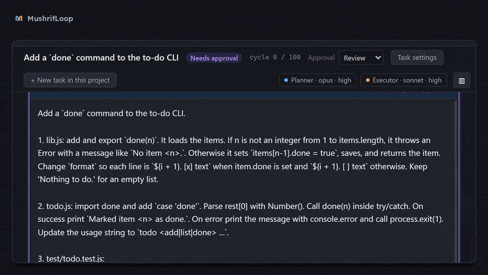

# MushrifLoop

**[Website](https://hqudsi.github.io/mushrifloop/)** · **[Download](../../releases/latest)** · [العربية](https://hqudsi.github.io/mushrifloop/ar/)



*One real task from start to finish, sped up. Recorded on an earlier version; the default models and effort have changed since.*

*Mushrif* (مشرف) is Arabic for "supervisor". MushrifLoop is a supervised two-agent orchestrator for
[Claude Code](https://claude.com/claude-code): a Windows desktop app that runs a coding task as a loop
between two Claude Code sessions on your own computer:

- a **Planner** reads the task, decides the next single step, and reviews each result. It never touches
  your files.
- an **Executor** carries out that one step in your project folder and reports what it changed and what it
  ran.

The app is the orchestrator between them. It passes each instruction and each report across, and it holds the limits and
checkpoints: approvals, cycle caps, timeouts, loop detection, a commit per cycle on a branch of its own,
account checks, and usage-limit handling. It stops and asks you whenever a decision is yours.

MushrifLoop is an independent open-source project. It is not affiliated with, endorsed by, or sponsored by
Anthropic. "Claude" and "Claude Code" are trademarks of Anthropic.

## What you need

- Windows 10 or 11, x64.
- **Claude Code installed and signed in on the machine**, version 2.1.251 or newer. The default Executor runs
  on Sonnet 5.5 from Claude Code 2.1.284; an older version runs it on Sonnet 5.
  Haiku 5.5, with its effort levels, needs Claude Code 2.1.293; an older version runs `haiku` on Haiku 4.5.

MushrifLoop never talks to the Anthropic API itself. Every turn is an ordinary `claude` process started on
your machine, unmodified, under whoever is signed in to Claude Code. All the work runs on your own Claude
account and its limits; the app has no account, key or billing of its own. First-run setup checks that the
CLI is present, new enough and signed in before it lets you start.

## What you get

- **Supervision.** Every instruction can be read and approved before it reaches the Executor.
- **A review of every step.** A second session checks each result against the task before the next step
  starts.
- **Coordination.** The app moves the work between the two sessions, and handles context, limits and
  handoffs itself.
- **Follow-up.** A timeline of every cycle, a commit per cycle, and the full record of every turn.
- **Your time.** A long task runs unattended and calls you only when a decision is yours.
- **Your tasks, in order.** Grouped by project, searchable, pinned to the top or archived; a deleted task
  goes to the Recycle Bin. The side panels can be widened or narrowed by dragging their edge.

## What it costs

How much it uses depends on the size of the task, on the models, and on what you compare it with.

**Version 1.4.0** runs the Planner on Opus 5.5 and the Executor on Sonnet 5.5, both at medium effort. It also
fixes two things that made large tasks expensive. We ran three large tasks, one run each, all on the same
Claude Code (2.1.291). Every hidden test passed in all three ways of working:

| | Cost, three tasks | Time, three tasks |
|---|---|---|
| MushrifLoop 1.4.0 | $9.95 | 44 min |
| Plain Claude Code, Opus 5.5 | $15.80 | 52 min |
| Plain Claude Code, Sonnet 5.5 | $11.39 | 47 min |

That is about 0.6 times plain Opus's cost, and 0.9 times plain Sonnet's, and it finished a little sooner. Three
tasks and one run each show that it is no longer the expensive option on large tasks. They are not enough to
rank the three.

The dollars are what Claude Code reports at API prices. On a subscription they count against your usage
limits instead.

**Version 1.3.0** ran the Executor on Sonnet 5 at high effort. Our first measurements (22 tasks, one run each):

- small and medium tasks cost about a quarter less than a plain Opus session;
- large tasks cost a little over twice as much, and took nearly twice as long;
- against a plain Sonnet session it cost more at every size;
- the three finished the medium and large tasks equally well.

The Planner is the small part of the cost: about 6% on large tasks. The Executor's work is the rest.

These are early numbers. Larger runs will be published here, whatever they say.

## Install

Download the installer (or the portable exe) from the [Releases](../../releases) page.

**The installer is not code-signed yet.** Windows SmartScreen will say "Windows protected your PC" and name
an unknown publisher. Choose **More info**, then **Run anyway**. Each release lists the SHA-256 of its
files, so you can check that what you downloaded is what was published:

```
certutil -hashfile MushrifLoop-<version>-x64-setup.exe SHA256
```

Signing through SignPath Foundation is being set up. The [code signing policy](https://hqudsi.github.io/mushrifloop/code-signing/)
says how releases are built and signed, and exactly what the app sends over the network. Releases after
1.7.0 are built by GitHub Actions from this repository ([the workflow](.github/workflows/release.yml)), and
each file carries a build provenance attestation you can check with
`gh attestation verify <file> -R hqudsi/mushrifloop`.

There is no auto-update. A new version is a new installer from the same page.

## Your data

- Tasks, settings and logs live in `%APPDATA%\MushrifLoop` on your machine. They stay there when you
  uninstall, unless you tick the box that says otherwise.
- The app collects nothing and has no telemetry. It makes two network requests itself, and sends nothing
  about you or your tasks in either: a check of the npm registry for the latest Claude Code version, to tell
  you when your CLI is out of date, and a check of GitHub for the latest MushrifLoop release, at start and
  once a day, to tell you when a new version is out (switch it off in Settings → General). The app never
  downloads or installs an update itself. Everything else on the network is Claude Code's own traffic.
- Deleting a task in the app moves its folder to the Recycle Bin. Your project, its git branch and Claude
  Code's own session files are not touched.
- In a project it works on, the Executor may write long evidence to a `.mushrifloop/` folder. That folder is
  never committed.

## From source

```
npm install
npm start
```

- `npm test` runs the test suite.
- `npm run typecheck` checks the main process and the tests.
- `npm run pack` builds the Windows installer and a portable exe into `release/`.

The code is Electron + Angular + TypeScript. The main process (`src/main/`) spawns the CLI, runs the
orchestrator's state machine and stores every turn; the renderer (`src/renderer/`) reaches it only through
the typed bridge in `src/preload/`. The agents' prompts are in `agents/`, and the JSON schemas their answers
must match are in `schemas/`. Comments in the code cite `SPEC.md` and `NOTES.md`: these are the project's
design documents, which are not part of this repository yet.

## Questions, bugs, security

- Questions and bugs: open an issue in this repository.
- Security problems: see [SECURITY.md](SECURITY.md).

## License

Apache License 2.0. See [LICENSE](LICENSE) and [NOTICE](NOTICE). The licenses of the open-source software
the app is built with are listed inside it, under Settings → About.

Copyright 2026 Hani Qudsi.
